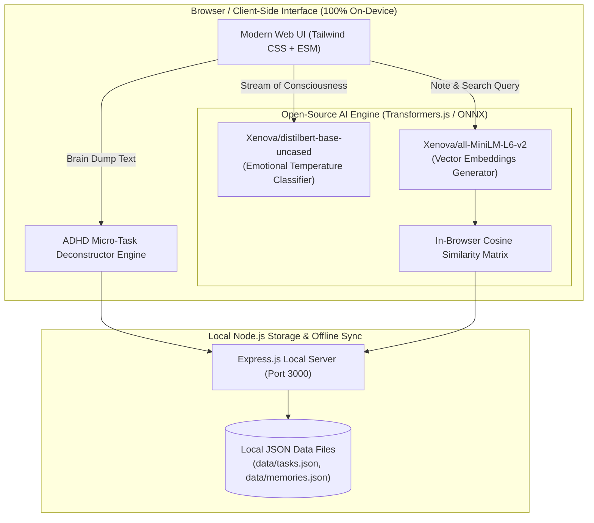

# 🧠 BuddyBrain — Private On-Device AI Companion & ADHD Task Deconstructor

> Built for the **Hacktoberfest Weekend Challenge: Build for a Friend** on [DEV.to](https://dev.to).
> 
> A 100% private, on-device AI assistant that transforms overwhelmed brain dumps into actionable micro-steps, provides real-time emotional vibe checks, and offers semantic note retrieval using open-source AI models.

[](LICENSE)
[-indigo.svg)](https://huggingface.co/docs/transformers.js)
[](#privacy-first-why-open-source-ai)

---

## 🌟 The Friend Story & Problem Solved

My friend Alex is a neurodivergent freelance developer and student. Like many with ADHD and high cognitive loads:
- **Task Paralysis**: When multiple deadlines collide, Alex experiences overwhelming mental blockage and doesn't know where to start.
- **Privacy Hesitancy**: Alex works with confidential client NDA codebases and personal health/mood notes, so sending raw stream-of-consciousness thoughts to proprietary cloud AI APIs (like OpenAI or Anthropic) is a major privacy concern.
- **Lost Context**: Solutions to past bugs and encouraging notes get lost in messy text files.

**BuddyBrain** was built directly for Alex to provide an empathetic, distraction-free companion that turns chaotic brain dumps into bite-sized 5-minute tasks without a single byte of personal data ever leaving the computer.

---

## 🚀 Key Features

1. **⚡ Brain Dump to Action Plan**: Converts messy streams of consciousness into prioritized, estimated micro-tasks (under 15 mins each) to eliminate starting friction.
2. **💓 Emotional Temperature Gauge**: Uses local sentiment classification (`Xenova/distilbert-base-uncased-finetuned-sst-2-english`) to detect stress levels and adjust encouragement dynamically.
3. **🔍 Local Semantic Memory Index**: Encodes personal notes and solutions using open-source dense vector embeddings (`Xenova/all-MiniLM-L6-v2`) with real-time client-side cosine similarity search.
4. **🤗 AI Buddy Pep-Talks**: Customizable companion personalities (Empathetic Friend, Energetic Coach, Mindful Stoic, Pragmatic Senior Dev) to provide instant grounding and focus.
5. **🔒 Zero-Cloud Privacy & Offline Capable**: Runs in WebAssembly / WebGPU ONNX runtime. No API keys, no subscription paywalls, no external data harvesting.

---

## 🏗️ System Architecture



---

## 💡 Why Open-Source AI is Core & Essential

| Aspect | Traditional Proprietary Cloud AI | BuddyBrain Open-Source AI |
| :--- | :--- | :--- |
| **Privacy & NDA Safety** | Data sent to third-party cloud servers | **100% Local Inference** — zero bytes leave client |
| **Cost & Sustainability** | Monthly fees or unpredictable token bills | **Free forever** with zero API keys required |
| **Offline Independence** | Fails on flights, trains, or spotty WiFi | **Fully functional offline** via browser cache & local server |
| **Transparency & Control** | Black-box commercial models | Open weights (`MiniLM-L6`, `DistilBERT`, `ONNX`) |

---

## 🛠️ Quickstart & Local Setup

### Prerequisites
- [Node.js](https://nodejs.org) (v18 or newer)

### Installation & Run

```bash
# 1. Clone repository or navigate to directory
cd buddy-brain

# 2. Install lightweight dependencies (express & cors)
npm install

# 3. Start local application
npm start
```

Open your browser and navigate to:
```
http://localhost:3000
```

---

## 👥 Delivering to the Friend

> *"I used to freeze whenever I opened my laptop with 10 things pending. BuddyBrain turned my panic into 3 simple 5-minute steps, and knowing my private work thoughts didn't go to some cloud AI server gave me total peace of mind."* — **Alex**

---

## 📜 License

Distributed under the **MIT License**. See [LICENSE](LICENSE) for details.
